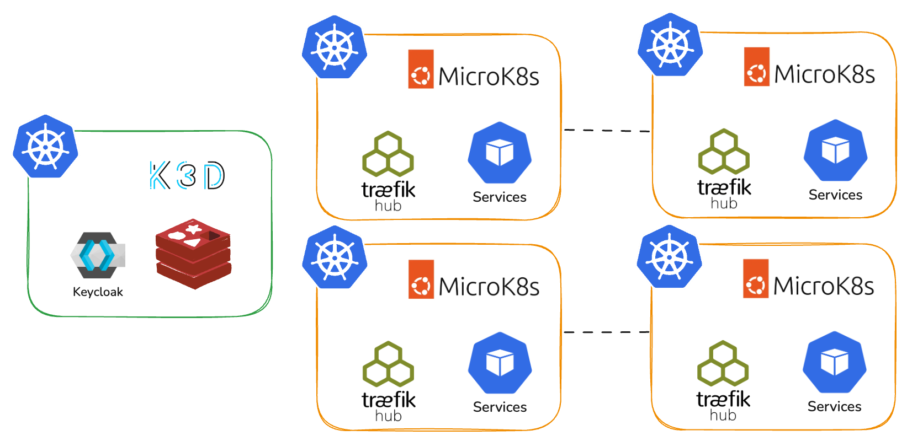
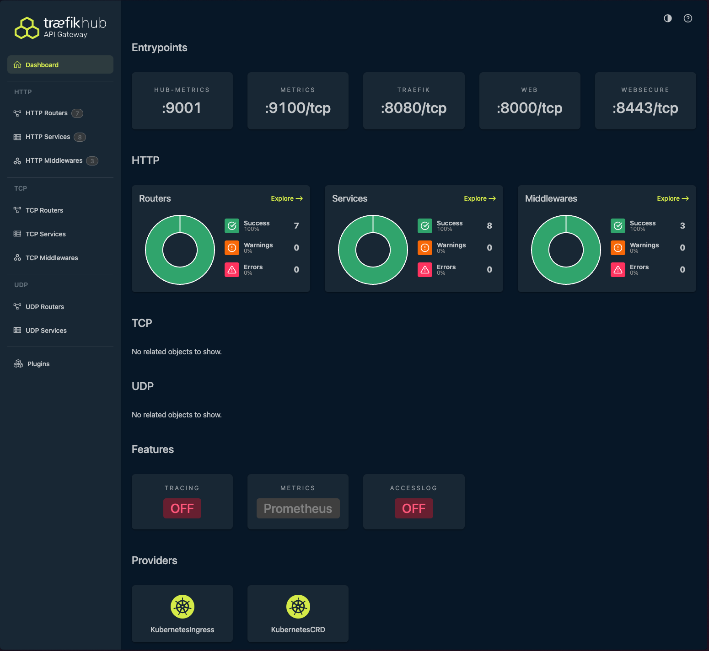
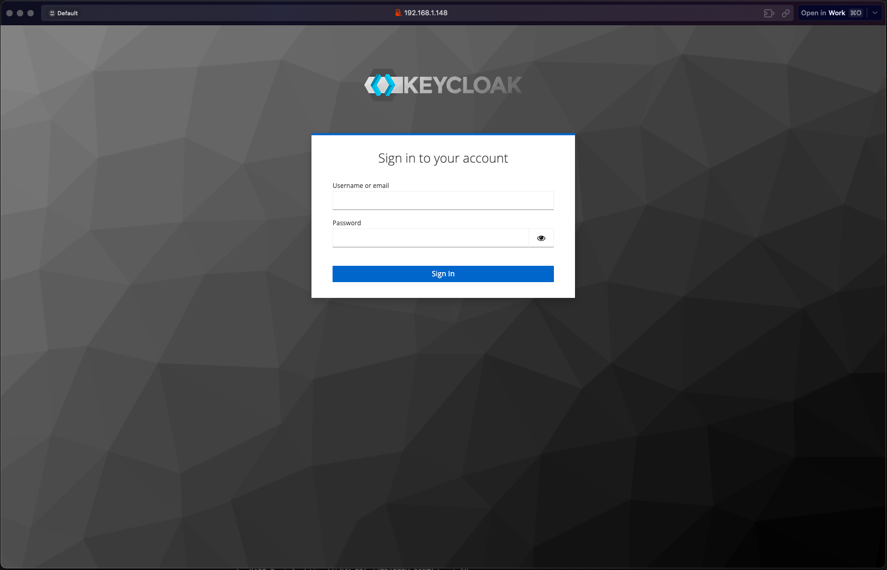
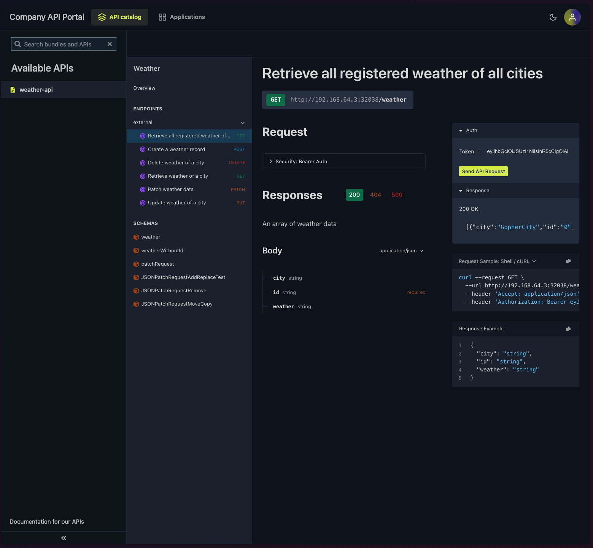

# Full Traefik API Management Offline Platform

A production-grade, self-contained API Management platform running fully offline with Traefik Hub, Keycloak, and Redis, orchestrated by MicroK8s Kubernetes clusters for the Traefik API Management and using k3d for the Keycloak and Redis services.

---

## Why this Supercharges Offline APIM

Deploying Traefik APIM on MicroK8s brings unique advantages for edge, developer, and air-gapped environments:

- **Ultra Lightweight & Fast:** MicroK8s is optimized for minimal resources run the entire APIM stack (gateway, SSO, caching) on laptops, edge devices, VMs ...
- **Fully Offline & Private:** All traffic, authentication, and caching occurs locally. No external cloud, SaaS, or managed services required; perfect for privacy, data sovereignty, and regulatory compliance.
- **Portability & Replicability:** Easily clone clusters and mirror production setups anywhere. Rapid prototyping, disaster recovery, and multi-site governance all managed with k8s-native automation.
- **Enterprise-Grade Features:** Traefik Hub delivers modern API management and security, Keycloak provides robust SSO/JWT/OAuth2, and Redis enables rate limiting all integrated.
- **Edge & Multi-Site Ready:** Use the same architecture for on-prem, edge, IoT, or multi-cloud setups. Deploy, sync, and operate wherever reliable API management is needed.
- **100% GitOps-Driven, No ClickOps:** Every component is deployed, updated, and managed using declarative manifests (YAML, Helm, k8s resources) and automated pipelines.
  - **No manual UI interaction or clickops:** All configuration, lifecycle, and updates are handled via version-controlled code for reproducibility, security, and automation.
  - Ensures auditability, rapid rollbacks, and consistency across environments.

---

## Architecture Overview



**Components:**
- MicroK8s – Kubernetes cluster
- Traefik Hub – Gateway & API Management
- Keycloak – SSO / OAuth2 / JWT provider
- Redis – Rate limiting & cache
- Weather API – Demo service

---

This architecture delivers robust, cloud-native API management—**any hardware, any location, anytime, with zero cloud dependency, and fully automated through GitOps**.

## Architecture

- **MicroK8s** - Kubernetes cluster
- **Traefik Hub** - API gateway & management
- **Keycloak** - OAuth2/JWT authentication  
- **Redis** - Rate limiting & caching
- **Weather API** - Sample application

## Prerequisites

For this demo I am using a macos machine, there could be some differences if you are using a different platform like fetching the IPs for the services or installing k3d and microk8s.

- Homebrew 
- `curl` installed

## Quick Start

### 1. Deploy K3D Services
```bash
# Deploy Redis and Keycloak
./k8s-manifests/scripts/deploy-k3d.sh
```

### 2. Setup MicroK8s
```bash
# Install MicroK8s
./k8s-manifests/scripts/deploy-microk8s.sh

# Get VM IP
export VM_IP=$(microk8s kubectl config view --minify -o jsonpath='{.clusters[0].cluster.server}' | sed 's|https://||' | sed 's|:.*||')
echo "VM IP: ${VM_IP}"
```

### 3. Install Traefik Hub

Get your free license from [traefik.io/traefik-hub](https://traefik.io/traefik-hub/), then deploy:

```bash
# Create Traefik Hub license secret (replace YOUR_LICENSE_TOKEN with your actual token)
# You can get a free license from: https://traefik.io/traefik-hub/
export TRAEFIK_HUB_TOKEN=YOUR_LICENSE_TOKEN

microk8s kubectl create namespace traefik --dry-run=client -o yaml | microk8s kubectl apply -f -
microk8s kubectl create secret generic traefik-hub-license \
  --namespace traefik \
  --from-literal=token="${TRAEFIK_HUB_TOKEN}"

# Add Traefik Helm repository
microk8s helm3 repo add traefik https://traefik.github.io/charts
microk8s helm3 repo update

# Set Redis connection details (get these from k3d deployment output)
export HOST_IP=${HOST_IP:-$(ifconfig | grep "inet " | grep -v 127.0.0.1 | head -1 | awk '{print $2}')}
export REDIS_ENDPOINT="${HOST_IP}:6380"
export REDIS_PASSWORD="redis_password123"

# Install Traefik Hub
microk8s helm3 upgrade --install --namespace traefik traefik traefik/traefik \
  --set hub.token=traefik-hub-license \
  --set hub.apimanagement.enabled=true \
  --set hub.offline=true \
  --set "providers.kubernetesCRD.allowExternalNameServices=true" \
  --set "providers.kubernetesCRD.allowCrossNamespace=true" \
  --set hub.redis.endpoints="${REDIS_ENDPOINT}" \
  --set hub.redis.password="${REDIS_PASSWORD}" \
  --set image.registry=ghcr.io \
  --set image.repository=traefik/traefik-hub \
  --set image.tag=v3.18.0-beta4

# Wait for Traefik to be ready
microk8s kubectl wait --for=condition=ready pod -l app.kubernetes.io/name=traefik -n traefik --timeout=300s
```

### Get Traefik Access Information

```bash
# Get VM IP and Traefik service port
export VM_IP=$(microk8s kubectl config view --minify -o jsonpath='{.clusters[0].cluster.server}' | sed 's|https://||' | sed 's|:.*||')
export TRAEFIK_PORT=$(microk8s kubectl get svc -n traefik traefik -o jsonpath='{.spec.ports[0].nodePort}')
echo "VM IP: ${VM_IP}"
echo "Traefik Port: ${TRAEFIK_PORT}"

# Set base URL for API access
export BASE_URL="http://${VM_IP}:${TRAEFIK_PORT}"
echo "Base URL: ${BASE_URL}"

```

```bash
# Deploy Traefik dashboard configuration
./k8s-manifests/traefik/deploy-dashboard.sh

# Test dashboard access
curl -s -o /dev/null -w "Dashboard Status: %{http_code}\n" "${BASE_URL}/dashboard/"
```
Use the output url from the bash scrip to access the dashboard.



### 4. Deploy API Management

The output of the bash script will show you the urls to access the API portal, Dashboard and the Keycloak Admin Console.

```bash
# Deploy Offline API Management
./traefik_apim_offline/deploy-apim.sh
```
## Credentials

**Keycloak Admin:** `admin` / `admin123`  
**Redis:** `redis_password123`  
**OAuth2 Client:** `traefik` / `traefik_secret`  
**Test User:** `traefik` / `topsecretpassword`

## Testing

### JWT Authentication

```bash
# Get JWT token from Keycloak
JWT_TOKEN=$(curl -s "http://${VM_IP}:8090/realms/master/protocol/openid-connect/token" -H "Content-Type: application/x-www-form-urlencoded" -d "grant_type=password&client_id=admin-cli&username=admin&password=admin123" | grep -o '"access_token":"[^"]*"' | cut -d'"' -f4)
echo "JWT Token obtained: ${JWT_TOKEN}"
```

```bash
curl -H "Authorization: Bearer $JWT_TOKEN" "http://${VM_IP}:${TRAEFIK_PORT}/weather/"
```

Open your Developer portal, login with your Keycloak user (admin/admin123) and test out your APIs using JWT authentication.




## Cleanup

```bash
./k8s-manifests/scripts/cleanup-microk8s.sh
./k8s-manifests/scripts/cleanup-k3d.sh
```

## Resources

- [MicroK8s Documentation](https://microk8s.io/docs)
- [Traefik Hub Documentation](https://doc.traefik.io/traefik-hub/)
- [Keycloak Documentation](https://www.keycloak.org/documentation)